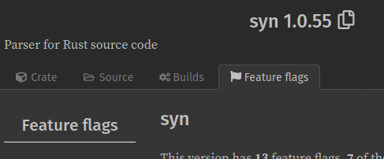

# Example of a genetic algorithm in Rust and Python

## Monkey typewriter

Finding the phrase 'To be or not to be. That is the question.' Inspired by the example given by [Coding Train](https://www.youtube.com/watch?v=9zfeTw-uFCw). 

Both algorithms start with a randomized array of characters as "genes". The list of individuals is sorted by most fit to least fit, then half of the list is considered "dead". The fit half of the least breeds to bring up the population. This is repeated until the algorithm arrives at the target string.

## How to run

```bash
# For rust
cargo run --release '<OPTIONAL_TARGET_PHRASE>'
# For python
python3 monkey.py '<OPTIONAL_TARGET_PHRASE>'
# For web example
yarn serve # npm run serve
```

## Things I've learned

### Supporting multiple architectures can be a pain

Wasm has pretty good support for most crates. I had a few surprising issues though. The first was that I couldn't figure out how to get the `rand` crate to run on wasm. Functions like `rand::thread_rng` aren't implemented for web assembly. There may have been a feature that I could have enabled to get it to work out of the box, but I didn't find any. This lead me to create some helper functions that would use `rand` on the host platform, and `js_sys` on wasm.

```rust
fn rand_char() -> char {
    #[cfg(target_arch = "wasm32")]
    {
        let c = (js_sys::Math::random() * (126.0 - 32.0) + 32.0).floor() as u8;
        c as char
    }
    #[cfg(not(target_arch = "wasm32"))]
    {
        rand::thread_rng().sample(&Uniform::new_inclusive(32u8, 126)) as char
    }
}
```

I have a lot of `cfg(...)` statements throughout the code. They clutter up the code and make things harder to read. I probably should have used a crate like `cfg_if`, but I digress.

I feel like there must be some a way to use `rand` on wasm, but I just wanted to get my code working and not sift through all the available features on the crate. Speaking of features...

### Docs.rs has a "Feature flags" button

I don't know why it took me so long to find this. It's right at the top of the header next to "Builds".



I was about to complain about docs.rs not having a features section when I decided to double check.

### Wasm code is blocking by default

This makes sense in hindsight, but I discovered this when I tried to have my simulation update the UI. My page would freeze and the browser would ask me if I wanted to stop the code. Making my `simulation` function `async` stopped the page from freezing, though I had to make some changes to get the browser to stop complaining about my code slowing things down.

In future I should create a web worker to run long standing code like this.

### Instant::now() panics

I was using `std::time::Instant::now()` for benchmarking purposes, and my code would panic when I called it on wasm. Apparently there are some parts of the OS that are unavailable to wasm. The system time is one of them. It's surprising that a core part of the standard library doesn't support wasm, but to be honest dealing with time is a major pain. You can check out [this issue](https://github.com/rust-lang/rust/issues/48564), if you want to know more.

### Compiling crates with --release

I've never really used `cargo run --release`, but when I was comparing the speeds of the wasm build and the regular Rust code, and I was suprised that the wasm was running faster. With the debug build I was getting around 900ms when running the simulation (my code code use some optimizing). The wasm code was getting around 50-100ms per run. Running with `--release` gives me in the 20s and 30s.